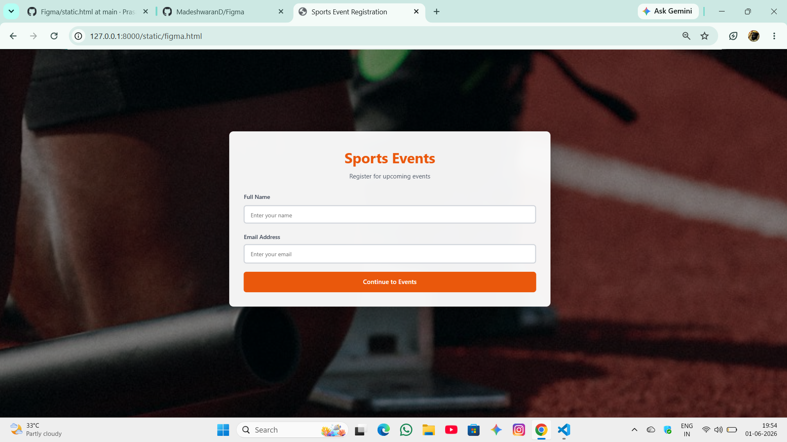
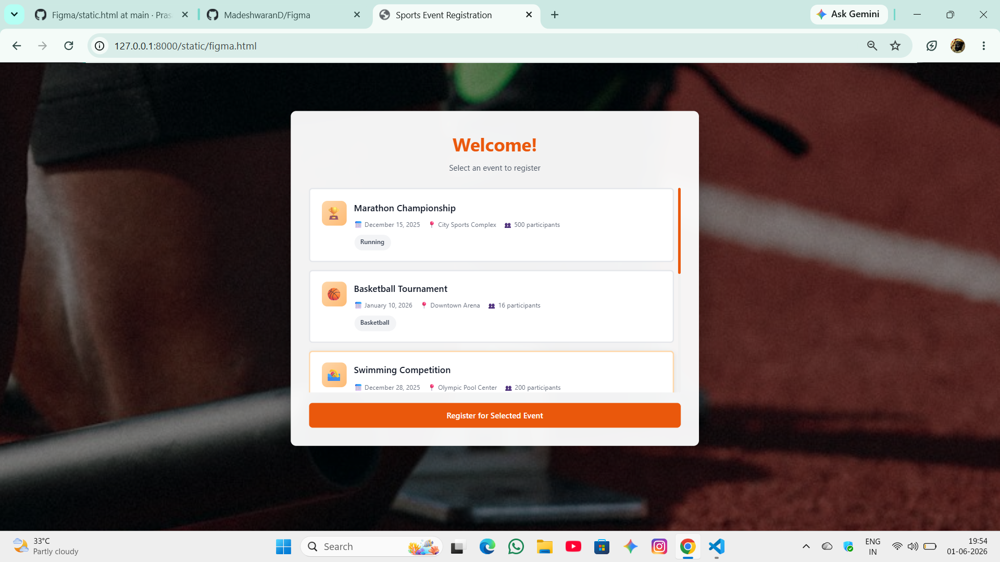
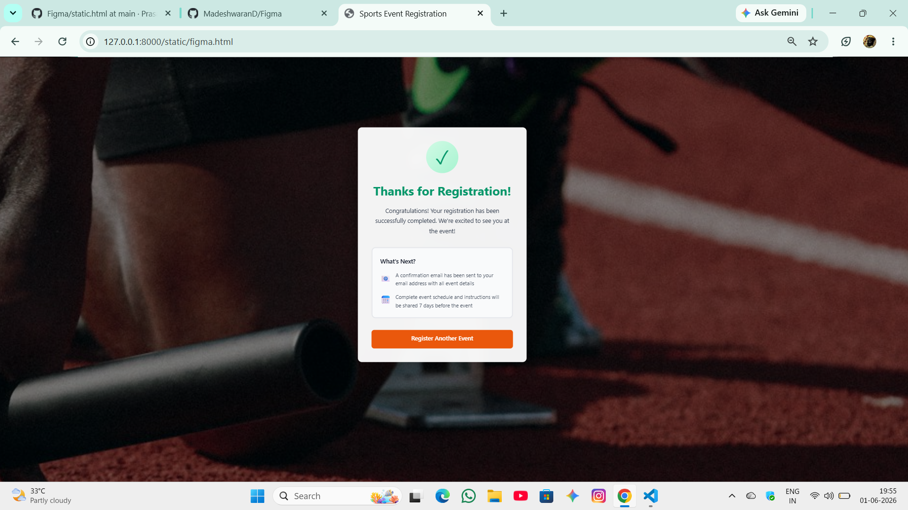

# Ex09 Event Registration Web Application
## Date:02/06/2026

## AIM:
To design, develop and deploy a web application for event registration.

## DESIGN STEPS:

### Step 1:
Create a new frame.

### Step 2:
Select any one preset size of your choice.

### Step 3:
Select the shapes you need.

### Step 4:
Import images as needed.

### Step 5:
Create pages based on your need and link them.

### Step 6:

Validate the HTML and CSS code.

### Step 6:

Publish the website in the given URL.

## DESIGN TOOL:
Figma

## CODE:
```
<!DOCTYPE html>
<html lang="en">
<head>
  <meta charset="UTF-8">
  <meta name="viewport" content="width=device-width, initial-scale=1.0">
  <title>Sports Event Registration</title>
  <style>
    * {
      margin: 0;
      padding: 0;
      box-sizing: border-box;
    }

    body {
      font-family: system-ui, -apple-system, BlinkMacSystemFont, 'Segoe UI', Roboto, sans-serif;
      line-height: 1.6;
    }

    .container {
      min-height: 100vh;
      background-image: url('https://images.unsplash.com/photo-1461896836934-ffe607ba8211?w=1920&q=80');
      background-size: cover;
      background-position: center;
      background-repeat: no-repeat;
      position: relative;
      display: flex;
      align-items: center;
      justify-content: center;
      padding: 20px;
    }

    .overlay {
      position: absolute;
      top: 0;
      left: 0;
      right: 0;
      bottom: 0;
      background: rgba(0, 0, 0, 0.5);
    }

    .content {
      position: relative;
      z-index: 10;
      width: 100%;
      max-width: 900px;
    }

    /* Hide radio buttons */
    input[type="radio"] {
      display: none;
    }

    /* Hide all frames by default */
    .frame {
      display: none;
    }

    /* Show frame based on checked radio */
    #frame-login:checked ~ .content #login-frame,
    #frame-events:checked ~ .content #events-frame,
    #frame-thanks:checked ~ .content #thanks-frame {
      display: block;
    }

    /* Card styling */
    .card {
      background: rgba(255, 255, 255, 0.95);
      backdrop-filter: blur(10px);
      border-radius: 12px;
      box-shadow: 0 20px 60px rgba(0, 0, 0, 0.3);
      padding: 40px;
    }

    .card-header {
      text-align: center;
      margin-bottom: 32px;
    }

    .card-header h1 {
      font-size: 2.5rem;
      color: #ea580c;
      margin-bottom: 8px;
      font-weight: 700;
    }

    .card-header p {
      color: #4b5563;
      font-size: 1.1rem;
    }

    /* Form styling */
    .form-group {
      margin-bottom: 24px;
    }

    .form-group label {
      display: block;
      color: #374151;
      margin-bottom: 8px;
      font-weight: 500;
      font-size: 1rem;
    }

    .form-group input {
      width: 100%;
      padding: 14px 16px;
      border: 2px solid #d1d5db;
      border-radius: 8px;
      font-size: 1rem;
      outline: none;
      transition: all 0.3s;
      font-family: inherit;
    }

    .form-group input:focus {
      border-color: #ea580c;
      box-shadow: 0 0 0 3px rgba(234, 88, 12, 0.1);
    }

    /* Button styling */
    .btn {
      display: inline-block;
      width: 100%;
      padding: 14px 24px;
      background: #ea580c;
      color: white;
      text-align: center;
      border-radius: 8px;
      cursor: pointer;
      transition: all 0.3s;
      border: none;
      font-size: 1.1rem;
      font-weight: 600;
      text-decoration: none;
    }

    .btn:hover {
      background: #c2410c;
      transform: translateY(-2px);
      box-shadow: 0 4px 12px rgba(234, 88, 12, 0.3);
    }

    .btn:active {
      transform: translateY(0);
    }

    /* Events list styling */
    .events-list {
      max-height: 450px;
      overflow-y: auto;
      margin-bottom: 24px;
      padding-right: 8px;
    }

    .events-list::-webkit-scrollbar {
      width: 8px;
    }

    .events-list::-webkit-scrollbar-track {
      background: #f1f1f1;
      border-radius: 4px;
    }

    .events-list::-webkit-scrollbar-thumb {
      background: #ea580c;
      border-radius: 4px;
    }

    .event-item {
      display: block;
      padding: 24px;
      border: 2px solid #e5e7eb;
      border-radius: 8px;
      margin-bottom: 16px;
      cursor: pointer;
      transition: all 0.3s;
      background: white;
    }

    .event-item:hover {
      border-color: #fed7aa;
      box-shadow: 0 4px 12px rgba(0, 0, 0, 0.1);
    }

    .event-radio:checked + .event-item {
      border-color: #ea580c;
      background: #fff7ed;
      box-shadow: 0 4px 12px rgba(234, 88, 12, 0.2);
    }

    .event-header {
      display: flex;
      align-items: flex-start;
      gap: 16px;
    }

    .event-icon {
      width: 56px;
      height: 56px;
      background: linear-gradient(135deg, #fed7aa 0%, #fdba74 100%);
      border-radius: 12px;
      display: flex;
      align-items: center;
      justify-content: center;
      font-size: 28px;
      flex-shrink: 0;
    }

    .event-details {
      flex: 1;
    }

    .event-title {
      font-size: 1.25rem;
      font-weight: 600;
      color: #111827;
      margin-bottom: 10px;
    }

    .event-meta {
      display: flex;
      flex-wrap: wrap;
      gap: 16px;
      color: #6b7280;
      font-size: 0.9rem;
      margin-bottom: 10px;
    }

    .event-meta span {
      display: flex;
      align-items: center;
      gap: 4px;
    }

    .event-category {
      display: inline-block;
      padding: 6px 14px;
      background: #f3f4f6;
      color: #374151;
      border-radius: 20px;
      font-size: 0.875rem;
      font-weight: 500;
    }

    /* Thank you frame styling */
    .thanks-card {
      text-align: center;
      max-width: 500px;
      margin: 0 auto;
    }

    .success-icon {
      width: 96px;
      height: 96px;
      background: linear-gradient(135deg, #d1fae5 0%, #a7f3d0 100%);
      border-radius: 50%;
      display: flex;
      align-items: center;
      justify-content: center;
      margin: 0 auto 24px;
      font-size: 56px;
      color: #059669;
      animation: scaleIn 0.5s ease-out;
    }

    @keyframes scaleIn {
      from {
        transform: scale(0);
      }
      to {
        transform: scale(1);
      }
    }

    .thanks-card h1 {
      color: #059669;
      margin-bottom: 16px;
      font-size: 2.25rem;
    }

    .thanks-message {
      color: #374151;
      margin-bottom: 32px;
      line-height: 1.7;
      font-size: 1.1rem;
    }

    .info-box {
      background: #f9fafb;
      border-radius: 12px;
      padding: 24px;
      margin-bottom: 32px;
      text-align: left;
      border: 1px solid #e5e7eb;
    }

    .info-box h3 {
      color: #111827;
      margin-bottom: 16px;
      font-weight: 600;
      font-size: 1.1rem;
    }

    .info-item {
      display: flex;
      gap: 12px;
      margin-bottom: 16px;
      color: #4b5563;
      font-size: 0.95rem;
      line-height: 1.6;
    }

    .info-item:last-child {
      margin-bottom: 0;
    }

    .info-icon {
      flex-shrink: 0;
      color: #ea580c;
      font-size: 1.5rem;
    }

    /* Responsive */
    @media (max-width: 768px) {
      .card {
        padding: 28px;
      }

      .card-header h1 {
        font-size: 2rem;
      }

      .event-meta {
        flex-direction: column;
        gap: 8px;
      }

      .events-list {
        max-height: 350px;
      }
    }

    @media (max-width: 480px) {
      .container {
        padding: 12px;
      }

      .card {
        padding: 20px;
      }

      .card-header h1 {
        font-size: 1.75rem;
      }

      .event-icon {
        width: 48px;
        height: 48px;
        font-size: 24px;
      }

      .event-title {
        font-size: 1.1rem;
      }
    }
  </style>
</head>
<body>
  <div class="container">
    <!-- Radio buttons for frame switching -->
    <input type="radio" name="frame" id="frame-login" checked>
    <input type="radio" name="frame" id="frame-events">
    <input type="radio" name="frame" id="frame-thanks">

    <div class="overlay"></div>

    <div class="content">
      <!-- Login Frame -->
      <div id="login-frame" class="frame">
        <div class="card">
          <div class="card-header">
            <h1>Sports Events</h1>
            <p>Register for upcoming events</p>
          </div>

          <form onsubmit="return false;">
            <div class="form-group">
              <label for="name">Full Name</label>
              <input
                type="text"
                id="name"
                placeholder="Enter your name"
                required
              >
            </div>

            <div class="form-group">
              <label for="email">Email Address</label>
              <input
                type="email"
                id="email"
                placeholder="Enter your email"
                required
              >
            </div>

            <label for="frame-events" class="btn">
              Continue to Events
            </label>
          </form>
        </div>
      </div>

      <!-- Events List Frame -->
      <div id="events-frame" class="frame">
        <div class="card">
          <div class="card-header">
            <h1>Welcome!</h1>
            <p>Select an event to register</p>
          </div>

          <div class="events-list">
            <!-- Event 1 -->
            <input type="radio" name="event" id="event-1" class="event-radio">
            <label for="event-1" class="event-item">
              <div class="event-header">
                <div class="event-icon">🏆</div>
                <div class="event-details">
                  <div class="event-title">Marathon Championship</div>
                  <div class="event-meta">
                    <span>📅 December 15, 2025</span>
                    <span>📍 City Sports Complex</span>
                    <span>👥 500 participants</span>
                  </div>
                  <span class="event-category">Running</span>
                </div>
              </div>
            </label>

            <!-- Event 2 -->
            <input type="radio" name="event" id="event-2" class="event-radio">
            <label for="event-2" class="event-item">
              <div class="event-header">
                <div class="event-icon">🏀</div>
                <div class="event-details">
                  <div class="event-title">Basketball Tournament</div>
                  <div class="event-meta">
                    <span>📅 January 10, 2026</span>
                    <span>📍 Downtown Arena</span>
                    <span>👥 16 participants</span>
                  </div>
                  <span class="event-category">Basketball</span>
                </div>
              </div>
            </label>

            <!-- Event 3 -->
            <input type="radio" name="event" id="event-3" class="event-radio">
            <label for="event-3" class="event-item">
              <div class="event-header">
                <div class="event-icon">🏊</div>
                <div class="event-details">
                  <div class="event-title">Swimming Competition</div>
                  <div class="event-meta">
                    <span>📅 December 28, 2025</span>
                    <span>📍 Olympic Pool Center</span>
                    <span>👥 200 participants</span>
                  </div>
                  <span class="event-category">Swimming</span>
                </div>
              </div>
            </label>

            <!-- Event 4 -->
            <input type="radio" name="event" id="event-4" class="event-radio">
            <label for="event-4" class="event-item">
              <div class="event-header">
                <div class="event-icon">🎾</div>
                <div class="event-details">
                  <div class="event-title">Tennis Open</div>
                  <div class="event-meta">
                    <span>📅 January 20, 2026</span>
                    <span>📍 Tennis Club Stadium</span>
                    <span>👥 64 participants</span>
                  </div>
                  <span class="event-category">Tennis</span>
                </div>
              </div>
            </label>

            <!-- Event 5 -->
            <input type="radio" name="event" id="event-5" class="event-radio">
            <label for="event-5" class="event-item">
              <div class="event-header">
                <div class="event-icon">⚽</div>
                <div class="event-details">
                  <div class="event-title">Soccer League Finals</div>
                  <div class="event-meta">
                    <span>📅 February 5, 2026</span>
                    <span>📍 National Stadium</span>
                    <span>👥 22 participants</span>
                  </div>
                  <span class="event-category">Soccer</span>
                </div>
              </div>
            </label>

            <!-- Event 6 -->
            <input type="radio" name="event" id="event-6" class="event-radio">
            <label for="event-6" class="event-item">
              <div class="event-header">
                <div class="event-icon">🏐</div>
                <div class="event-details">
                  <div class="event-title">Volleyball Championship</div>
                  <div class="event-meta">
                    <span>📅 February 15, 2026</span>
                    <span>📍 Beach Sports Arena</span>
                    <span>👥 32 participants</span>
                  </div>
                  <span class="event-category">Volleyball</span>
                </div>
              </div>
            </label>
          </div>

          <label for="frame-thanks" class="btn">
            Register for Selected Event
          </label>
        </div>
      </div>

      <!-- Thank You Frame -->
      <div id="thanks-frame" class="frame">
        <div class="card thanks-card">
          <div class="success-icon">✓</div>
          
          <h1>Thanks for Registration!</h1>
          
          <p class="thanks-message">
            Congratulations! Your registration has been successfully completed. We're excited to see you at the event!
          </p>

          <div class="info-box">
            <h3>What's Next?</h3>
            <div class="info-item">
              <span class="info-icon">📧</span>
              <p>A confirmation email has been sent to your email address with all event details</p>
            </div>
            <div class="info-item">
              <span class="info-icon">📅</span>
              <p>Complete event schedule and instructions will be shared 7 days before the event</p>
            </div>
          </div>

          <label for="frame-events" class="btn">
            Register Another Event
          </label>
        </div>
      </div>
    </div>
  </div>
</body>
</html>
```

## OUTPUT:





## RESULT:
The program to design, develop and deploy a web application for event registration is completed successfully.
